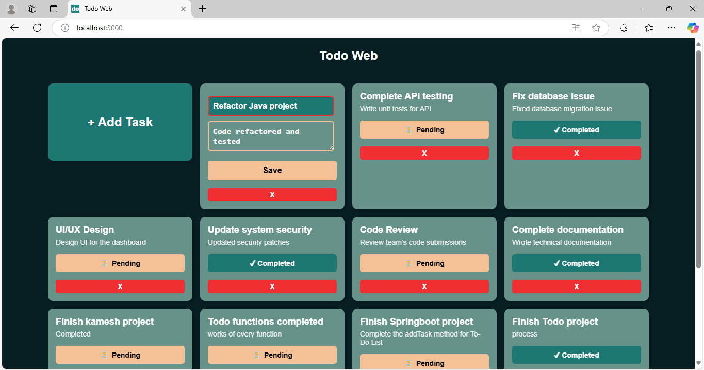
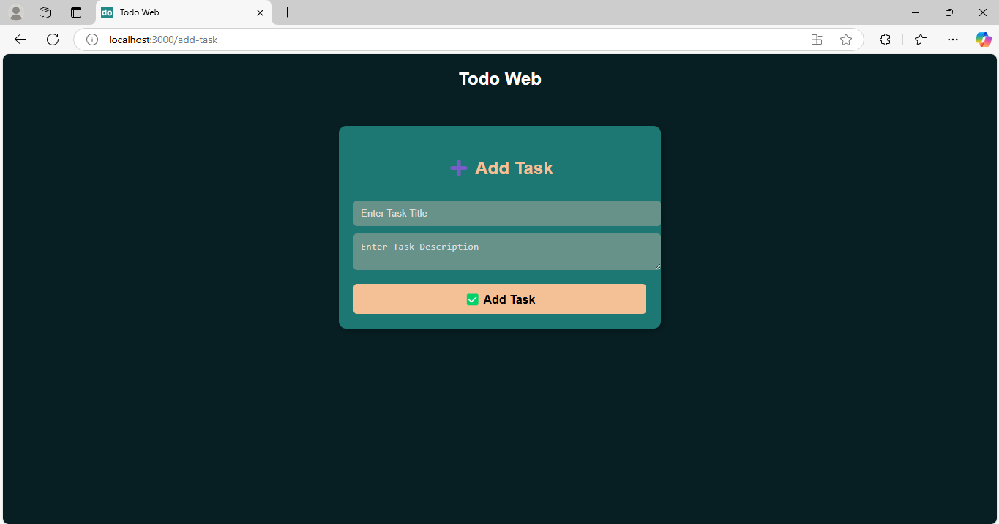
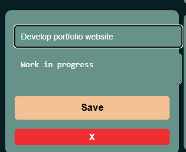
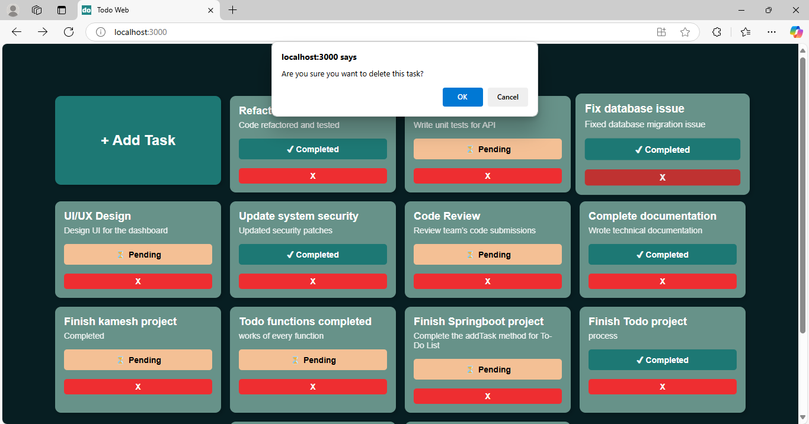

# Todo Web Backend

This is the backend for the **Todo Web Application**, built using **Spring Boot**. It provides RESTful APIs for managing tasks, including adding, editing, deleting, and displaying tasks.

## UI Screenshots

### Dashboard (Task List)



### Add Task



### Edit Task



### Delete Task



## Setup Instructions

Follow these steps to set up the backend on another system:

### Prerequisites

- Install **Java 17+**
- Install **Spring Boot**
- Install **Maven**
- Install **MySQL Server**

### Steps

1. **Clone the Repository**

   ```sh
   git clone https://github.com/mohamedshahban94/Todo-Web.git
   cd Todo-Web/backend
   ```

2. **Configure Database**

   - Open `application.properties` (or `application.yml`) in `src/main/resources`
   - Update the MySQL database credentials:
     ```properties
     spring.datasource.url=jdbc:postgresql://localhost:5432/ToDoListWeb
     spring.datasource.username=postgres
     spring.datasource.password=0000
     ```
   - Create the database in MySQL:
     ```sql
     CREATE DATABASE todo_list;
     ```

3. **Build and Run the Backend**

   ```sh
   mvn clean install
   mvn spring-boot:run
   ```

4. **Verify the API** Open your browser or use Postman to test the API:

   ```sh
   http://localhost:8080/api/home
   ```

## API Endpoints

| Method | Endpoint          | Description    |
| ------ | ----------------- | -------------- |
| GET    | `/api/home`      | Get all tasks  |
| POST   | `/api/addTask`      | Add a new task |
| PUT    | `/api/editTask/{id}` | Update a task  |
| DELETE | `/api/dropTask/{id}` | Delete a task  |

## Frontend Integration

The backend serves data to the **React frontend**. Ensure the frontend's API URL matches the backend endpoint.

## Contribution

Feel free to fork and contribute! Submit a pull request with improvements.

## License

This project is open-source under the MIT License.

